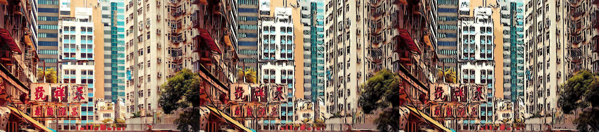
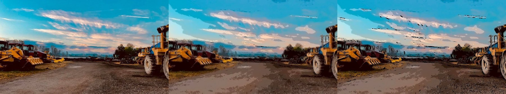
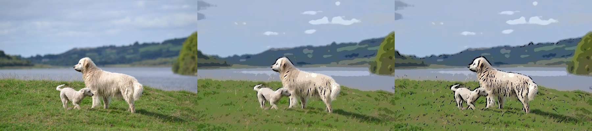
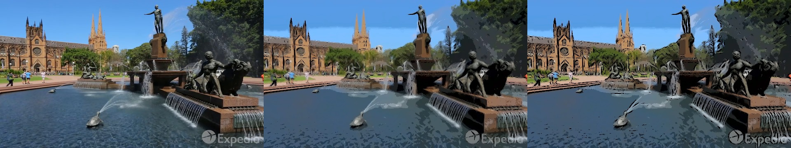
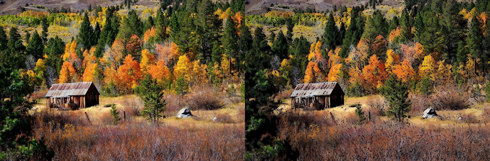
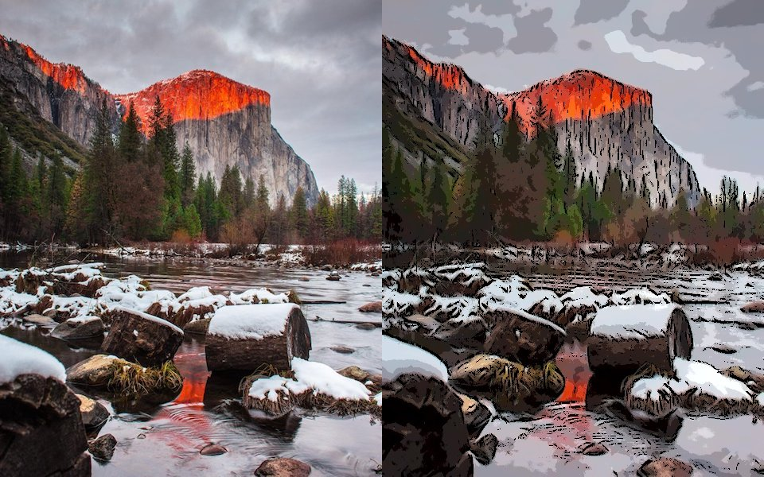
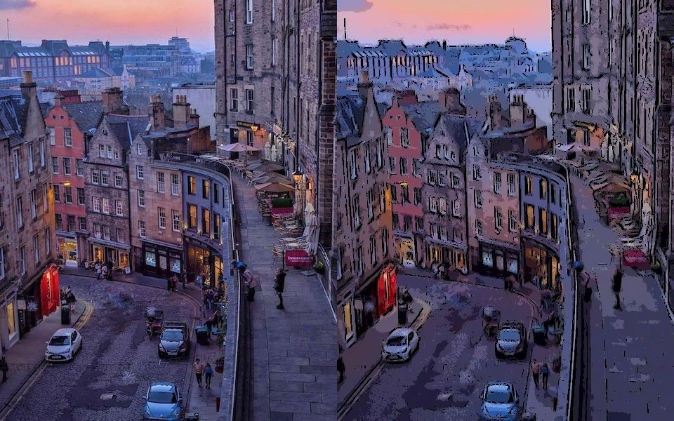
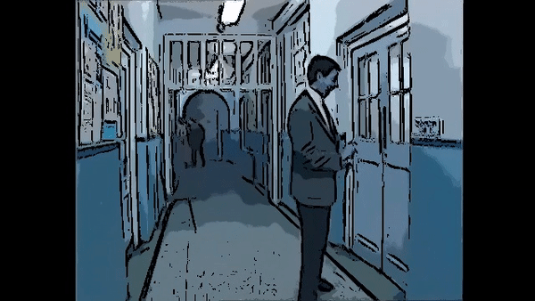

# flow-based-image-abstraction
This repository is the implementation of the paper [Flow-Based Image Abstraction](http://www.cs.umsl.edu/~kang/Papers/kang_tvcg09.pdf) by Henry Kang, Seungyong Lee and Charles K. Chui.

### Running
```python
python3 run.py --file FILE_PATH
```
By default the program will generate 5 images with different amount of edges. The following flags can be used. 

`--threading` to enable threading. This will create separate threads for FBL and FDoG. Also FDoG for different values of r will also be calculated in separate threads. Though we didn't see much speedup by enabling threading.

`--greyscale` flag will remove chrominance from the image resulting in greyscale image.

The program takes around 5 min for 600*800 images. If you have a very large image, please reduce the size.

Other flags will be added later

### Outputs
Here are few of the samples generated so far. The leftmost is the original image, the middle one and the right figures are generated using r = 0.5 and 0.8 for FDoG.









### More outputs
The left image is the original whereas the right image is the best looking among r = 0.5,0.6,0.7,0.8







### Still more outputs

The following were created by running the above program on each frame of video and then merging them.




