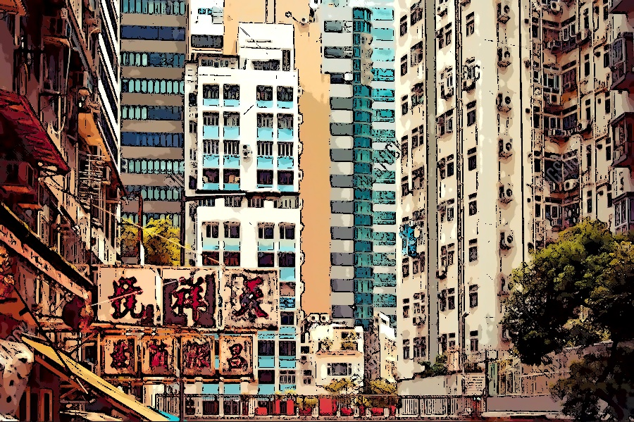
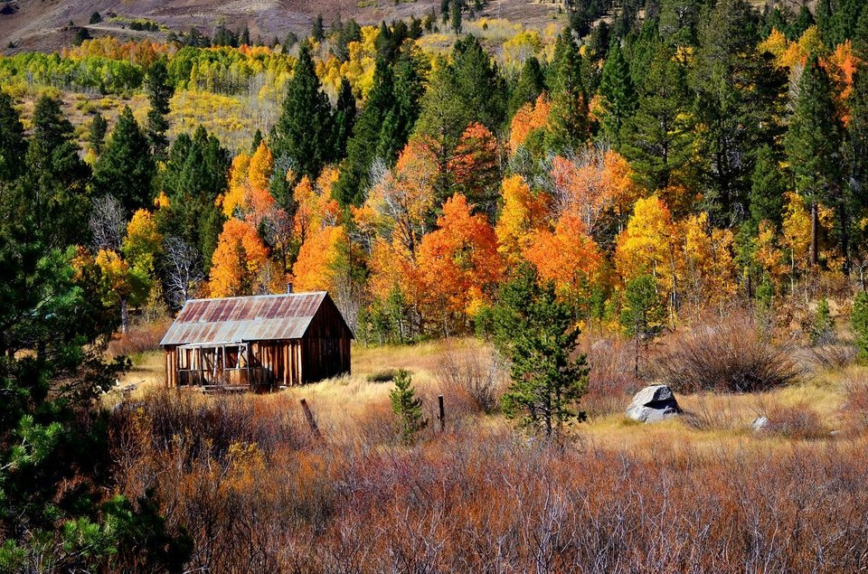
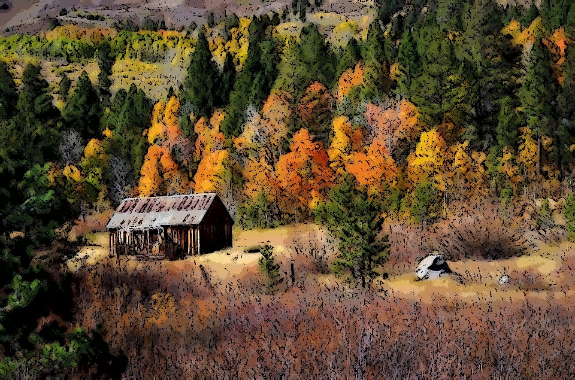
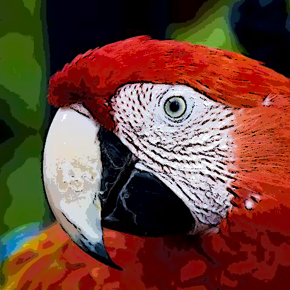

# flow-based-image-abstraction
This repository is the implementation of the paper "[Flow-Based Image Abstraction](http://www.cs.umsl.edu/~kang/Papers/kang_tvcg09.pdf)" by Henry Kang, Seungyong Lee and Charles K. Chui.

Here are few of the samples generated so far

Original Image | Final Image 
:-------------------------:|:-------------------------:
  | 
  | 
  | 
  | 
  | 